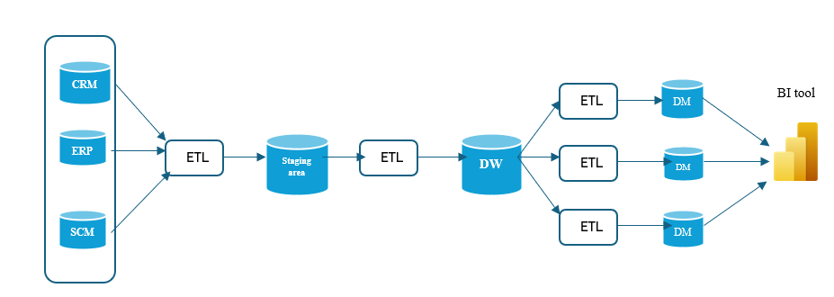
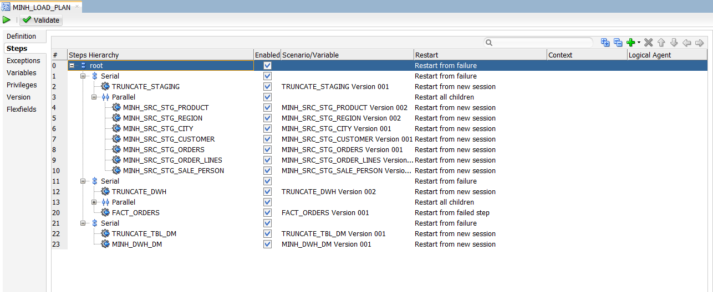
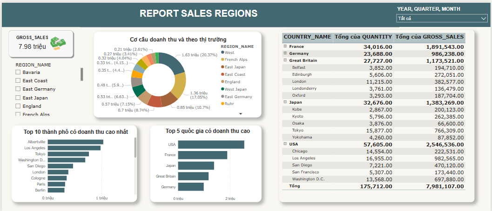
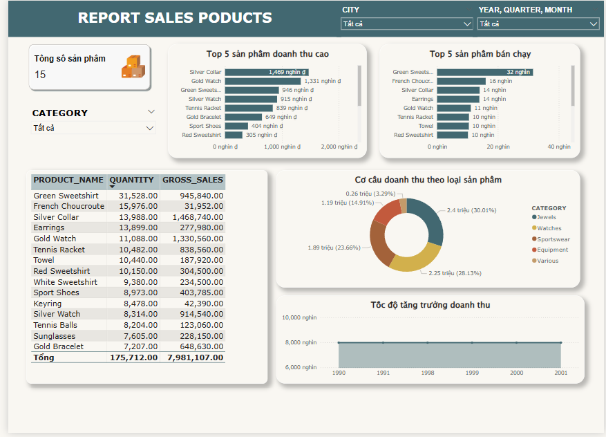

# DỰ ÁN DATA WAREHOUSE

## Giới thiệu dự án

Dự án Data Warehouse này mô phỏng quy trình tích hợp, xử lý và phân tích dữ liệu từ hệ thống bán hàng (CRM/ERP/SCM) qua các bước ETL, lưu trữ tập trung trên kho dữ liệu (DWH), xây dựng Data Mart phục vụ phân tích đa chiều, và trực quan hóa báo cáo bằng Power BI. Toàn bộ quy trình sử dụng Oracle Database, Oracle Data Integrator (ODI) và Power BI Desktop.

---

## Mục tiêu và giá trị nổi bật

- Chuẩn hóa luồng dữ liệu từ nhiều hệ thống về một mô hình dữ liệu nhất quán, phục vụ phân tích dữ liệu chính xác và kịp thời.
- Ứng dụng các kỹ thuật Data Warehouse và SCD (Slowly Changing Dimension) hiện đại.

---

## Kiến trúc hệ thống

- Nguồn dữ liệu: Hệ thống CRM, ERP, SCM (Orders, Customers, Products, Sales Person,...)
- Staging Area: Vùng lưu tạm dữ liệu ETL từ nguồn
- Data Warehouse (DWH): Kho dữ liệu tổng hợp, lưu trữ chuẩn hóa (Star Schema)
- Data Mart: Các bảng tổng hợp phục vụ cho từng nhu cầu báo cáo/phòng ban
- BI Tool: Power BI kết nối trực tiếp với Data Mart/DWH

Sơ đồ tổng thể:  

---

## Thiết kế dữ liệu & Data Dictionary

### 1. Bảng nguồn (Source)
- SRC_REGION: REGION_ID, COUNTRY, REGION
- SRC_CITY: CITY_ID, CITY, POPULATION, REGION_ID
- SRC_CUSTOMER: CUST_ID, DEAR, LAST_NAME, FIRST_NAME, ADDRESS, PHONE, AGE, SALES_PERS_ID
- SRC_PRODUCT: PRODUCT_ID, PRODUCT, PRICE, FAMILY_NAME
- SRC_ORDERS: ORDER_ID, ORDER_DATE, CUST_ID, CITY_ID
- SRC_ORDER_LINES: ORDER_ID, PRODUCT_ID, QTY
- SRC_SALE_PERSON: SALES_PERS_ID, FIRST_NAME, LAST_NAME, HIRE_DATE

### 2. Bảng Staging
- Giữ nguyên cấu trúc và dữ liệu như bảng nguồn, prefix STG_

### 3. Data Warehouse (DWH)
#### Dimension Table
- DIM_DATE: DATE_ID, DATE_KEY, MONTH, QUARTER, YEAR, DAY_OF_MONTH, DAY_OF_WEEK, MONTH_ID, DAY_NAME
- DIM_CUSTOMER: CUSTOMER_ID, DEAR, LAST_NAME, FIRST_NAME, ADDRESS, PHONE, AGE
- DIM_PRODUCT: PRODUCT_ID, PRODUCT_NAME, PRICE, CATEGORY
- DIM_SALES_PERSON: SALES_PERSON_ID, FIRST_NAME, LAST_NAME, HIRE_DATE
- DIM_CITY: CITY_ID, CITY_NAME, POPULATION, COUNTRY_NAME, REGION_NAME

#### Fact Table
- FACT_ORDERS: ORDER_DATE, CITY_ID, CUST_ID, ORDER_ID, SALES_PERSON_ID, PRODUCT_ID, QUANTITY, UNIT_PRICE, GROSS_SALES

### 4. Data Mart
- RPT_SALE_MONTH: Báo cáo doanh thu, số lượng theo tháng và từng sản phẩm
- RPT_REGION_MONTH: Báo cáo doanh thu, số lượng theo tháng, từng vùng

---

## Quy trình ETL chi tiết

### 1. Chuẩn bị môi trường
- Cài đặt Oracle Database, Oracle ODI Studio, Power BI Desktop
- Cấu hình kết nối DB (Host, Port, Service Name, User) cho từng khu vực: Source, Staging, DWH, Data Mart

### 2. Source → Staging
- Tạo folder ETL mapping 1:1 từ Source sang Staging (không biến đổi dữ liệu)
- Reverse-Engineering schema từ Source sang Staging trong ODI

### 3. Staging → Data Warehouse
- Tạo mapping ETL chuyển dữ liệu từ Staging vào DWH theo logic chuẩn hóa (theo Star Schema)
- Tách riêng các mapping cho từng bảng dimension và bảng fact

### 4. DWH → Data Mart
- ETL tổng hợp từ DWH vào Data Mart để phục vụ cho từng loại báo cáo

### 5. Xây dựng luồng tổng thể (Load Plan) & Lập lịch
- Tạo Load Plan gom toàn bộ các job ETL thành luồng tổng (Source → Staging → DWH → Data Mart)
- Lập lịch chạy tự động bằng ODI Agent
  
### 6. Kết nối và xây dựng báo cáo BI với Power BI
- Kết nối Power BI trực tiếp đến các bảng Data Mart trên Oracle Database
- Thiết kế dashboard báo cáo động: doanh thu theo vùng, sản phẩm, thời gian; biểu đồ cột, tròn, card tổng hợp, filter linh hoạt

### 7. Xử lý SCD Type 2 (Lưu vết thay đổi lịch sử)
- Thiết kế bảng DIM_CUSTOMER_SCD để lưu lịch sử khách hàng (thêm cột starting_date, ending_date, status_flag)
- Mapping nâng cao: khi thông tin khách hàng thay đổi, insert dòng mới và cập nhật trạng thái cho bản ghi cũ

---

